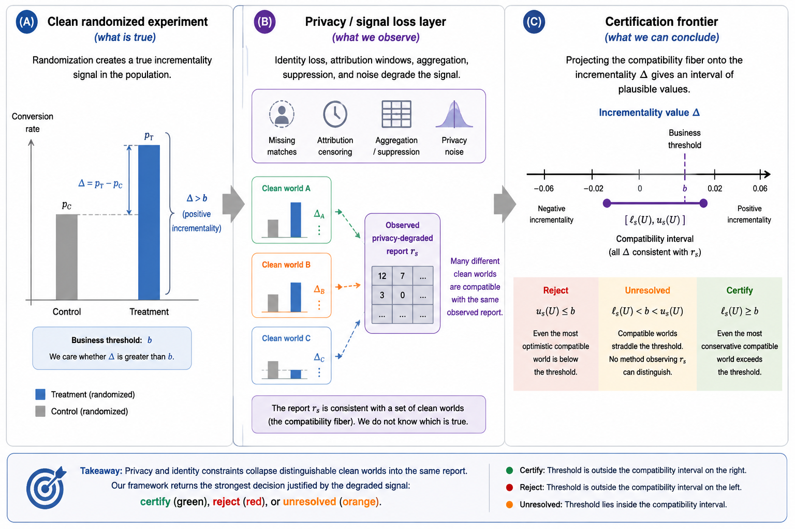

# Privacy-Robust Incrementality Measurement under Signal Loss

This repository is the notebook-first code companion for the paper
`Privacy-Robust Incrementality Measurement for Advertising Systems under Signal Loss`.

License: MIT

Tags: `incrementality`, `causal-inference`, `advertising`, `privacy`, `partial-identification`

## Workflow

Run notebooks from `code/notebooks/` in numerical order. Main-body experiments are `01` through `03`; appendix diagnostics are `04` through `07`.

| Notebook | Paper role | Theoretical results tested | Main artifacts |
|---|---|---|---|
| `00_dataset_readiness.ipynb` | Setup | Dataset assumptions and stress-layer inputs | `dataset_readiness.csv` |
| `01_main_certification_frontier.ipynb` | Main body | Theorem 5.1 and Section 5.2 | `privacy_frontier_main.png`, `main_certification_frontier.csv` |
| `02_main_sample_complexity_minimax.ipynb` | Main body | Proposition 5.2 and Theorem 5.3 | `sample_complexity_main.png`, `sample_complexity_required_n.csv` |
| `03_main_granularity_segment_safety.ipynb` | Main body | Section 5.5 | `granularity_tradeoff_main.png`, `granularity_segment_safety.csv` |
| `04_appendix_fiber_unresolved_diagnostics.ipynb` | Appendix | Lemma B.1 and Theorem 5.1 diagnostics | `fiber_projection_appendix.csv` |
| `05_appendix_privacy_mde_noise.ipynb` | Appendix | Proposition B.2 | `privacy_mde_appendix.png` |
| `06_appendix_heterogeneous_signal_loss.ipynb` | Appendix | Appendix B.3 example | `heterogeneous_reversal_appendix.csv` |
| `07_appendix_algorithm_manifest.ipynb` | Appendix | Algorithm 1 consistency checks | `theory_to_artifact_manifest.csv`, `algorithm_validity_check.csv` |

## Data

The notebooks use two public randomized marketing datasets from the shared `data/` directory:

- `data/criteo/criteo-research-uplift-v2.1.csv.gz`
- `data/hillstrom/archive.zip`

Raw data are not copied into this code folder.

## Outputs

Generated outputs are written under `artifacts/` and are ignored by git except placeholder files.
